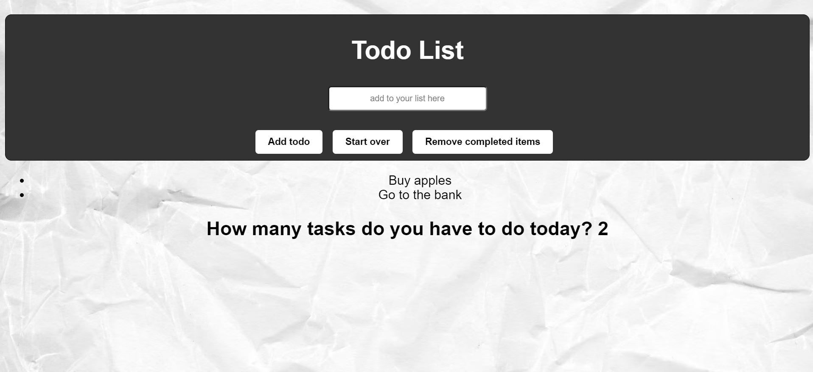

# Todo List
A simple to do list. Users are able to add items, remove completed items, 

Link to project:

# How It's Made:
Tech used: HTML, CSS, JavaScript

# Lessons Learned
This project introduced me to many things: appendChild() and .createElement() specifically were fun discoveries. This project also allowed me to see hoisting in action. I was able to use hoisting to call functions in my code prior to their declaration. 

