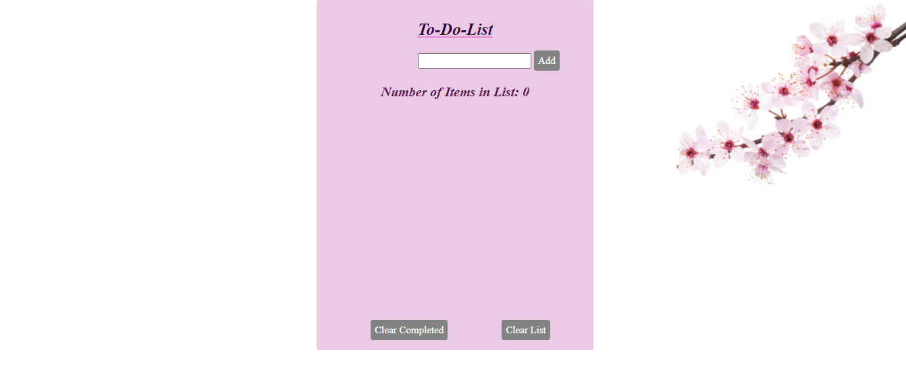

# ✅ Week05 Bootcamp2019 Project: Todo List
# My Todo List Project
This project acts as a user friendly task storage locker for temperory or long term tasks. Users are able to add, delete and clear tasks as they please.

**Link to project:https://ddtodolist.netlify.app/ ** 

## How It's Made:

**Tech used:** HTML, CSS, JavaScript

I utilized my skills in javaScript, HTML and CSS to create what I see as a functional and user-friendly program. Creating functions and Event Listeners to listen for the user's input/click. 

## Lessons Learned:
I learned how to create HTML elements within javaScript by using document.createElement - and further manipulating the innerText of the tags.
