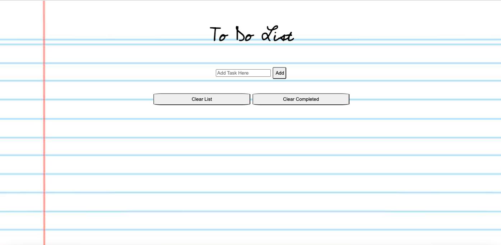

# Mental Notes: To-Do List
Mental Notes is a simple web application for a quick and easy way to jot down tasks. You have the ability to add tasks and cross each one out manually upon completion. If you need to clear all your completed tasks all at once, you can do that with a click of a button! You can also clear all tasks and start fresh. 

**Link to project:** https://mental-notes.netlify.app/

## How It's Made:

**Tech used:** HTML, CSS, JavaScript

## Lessons Learned:

This was really fun to make, but I definitely underestimated how challenging building this to-do list would be. It was easy to design and think about what needed to be done to create a functioning to do list (i.e. ability to add a task, ability to delete a task, etc). What proved to be a bit more difficult was how to communicate to the computer in the best way on how to make certain actions happen (i.e. having tasks that are clicked be crossed out as completed in red). 
