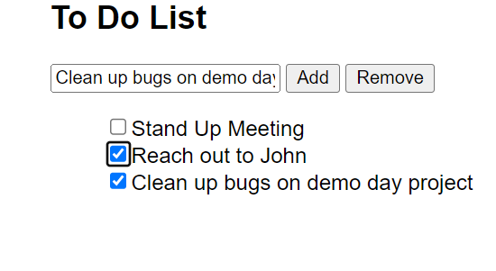

# ✅ Week05 Project: Todo List

I created a To-Do List in which the user can type in tasks and add it to a list and can remove the task from the list once they are completed with their task. I used HTML and Javascript in this project.

link to the project : https://burhan-ali-todolist.netlify.app/

