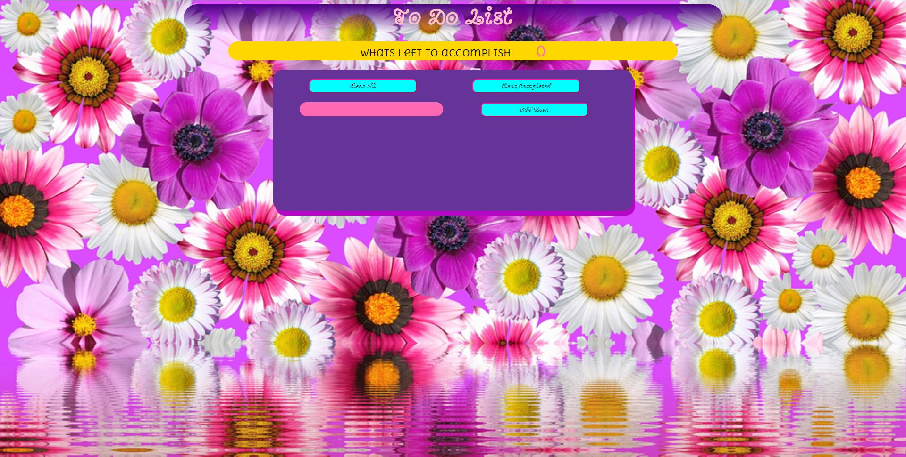

# ✅ To Do List

**Goal:** Build a simple to do list using vanilla JS.

**Link to project:** TBA

## How It's Made:

  **Languages used:**  HTML, CSS, JavaScript, Framework of choice

  - Created seperate functions to create an clear all, clear done.

## Optimizations
  - ADD an edit option
  - IMPROVE syntax consistently

## Lessons Learned:
  This was a lot harder than I thought. The attempt to implementing an edit feature was interfering alot with the other button functions 
## Examples:
Take a look at these couple examples that I have in my own portfolio:

**Slot Machine:** https://github.com/zjacobsdev/slot-machine-2019-week05/tree/answer
