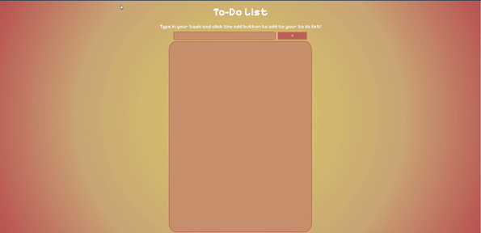

# My To Do List 

This is a simple to do list project I created. It allows the user to add tasks to a list and clear each task when they are done.

Link to project: https://to-do-roreecedev.netlify.app/

## How It's Made:

Tech used: HTML, CSS, JavaScript

I used HTML to create the base of the to do list. I used a div to contain everything. Then inside two divs for the list and for the task input section. Inside each I had the forms. For the top div I added a form with and text input and a button for the user to type and submit their task. Then in the bottom div I added the form, which held and empty ul to add the list items to. Lastly I added a container to hold the notification that if the user didn't enter a task it would notify them. 

I used JavaScript to build the logic of the to do list. So first I created two variables to hold the task list ul and the task input to make it easier to call them. Then I created an event listener so that when user clicked on the add button it would run the function to add the input value to the ul as a list item. 

Next I creatd the addMyTask function, I made it so this function would use an if statement to first check if the user put an value in the task input and if they didn't then it would notify them that they need to input a value. Next in the else statement, I had I used the createElement method to create and li and assign to variable li. I created another varible to hold the input html code and the value of the input and assigned it to the innerHTMl of the LI varibable. Then I used the appendChild() method to add each list item to the end of the ul. Outside of the if statement I cleared the input value after the user submits the task.

Then I created an event listener on the ul that would run an anonymous function with the event object as a parameter. This function would listen for a click and if the target contained a specific class list would run the function removeTask() with the argument of the target the user clicked on.The function removeTask() has a parameter and inside the function it takes the parameter and targets the li it's on using the parentElement object. Then runs the remove() method on that element. 

## Optimizations:

I updated the user interface, it was hard to see the task with the color pairing I chose originally.

## Lessons Learned:

What I learned from this project is that it easier to target something that is already in the DOM instead of targeting something I make appear in the DOM after a certain action is performed.  I originally wrote my code to target the checkbox input for the event listener and then when checked === true it would clear the item. For some reason it would clear the checkout and the list value separately but no altogether. I had to target the ul and do it that way and it was easier to execute.

