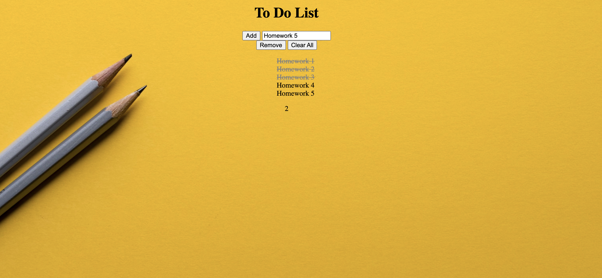

# 🎰 Week05: Todo List

Technology used is HTML, CSS & JAVASCRIPT

### Goal: Build a  Todo List

Build a To Do List which allows useres to list out things and cross them off as they are complete. 

### How to submit your code for review:

## Link to project
https://miriam-to-do.netlify.app/

