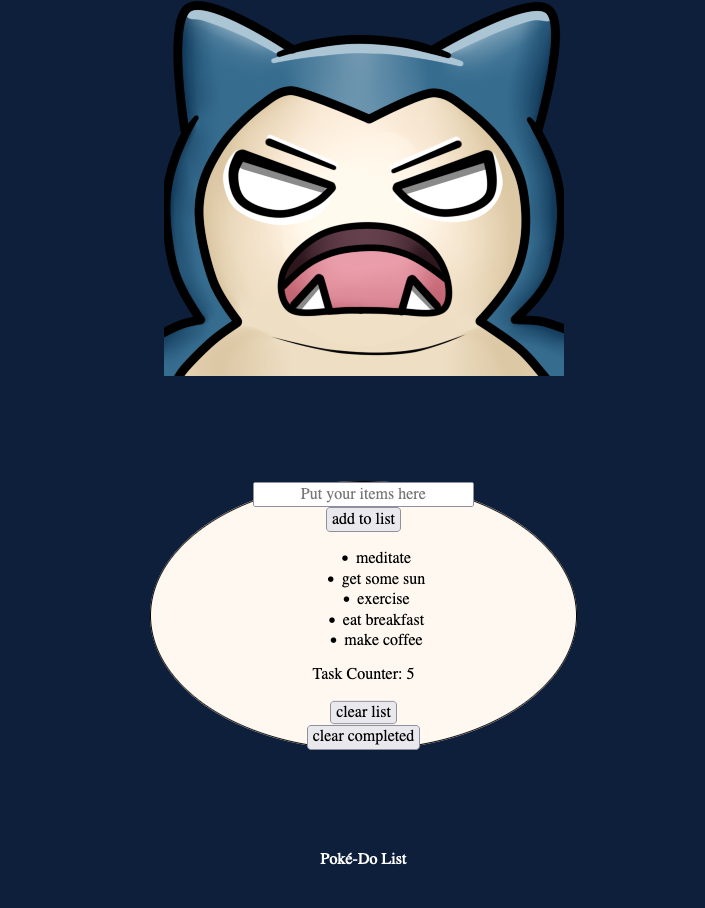

# Task List
This is a project for creating a task list. You can add tasks to a list, mark off your completed tasks, clear the task list, or clear the completed tasks. A task counter is also a feature of this task list. The task list theme is of a Pokemon character Snorlax.

**Link to project:** https://optimistic-benz-e4a984.netlify.app

## How It's Made:

**Tech used:** HTML, CSS, JavaScript

To make this To-Do list you need to start off with creating 3 buttons with event listeners. You will need 3 functions: 1. To clear the list 2. To clear the completed tasks 3. Transfer each input into your list. Bonus points for adding a task counter and using JS to dynamically cross off completed list items by clicking them.

## Optimizations

## Lessons Learned:

Some great takeaways from this project are adding rules to each function to account for an update of the task counter when things are added, removed, or crossed off.

## Examples:

