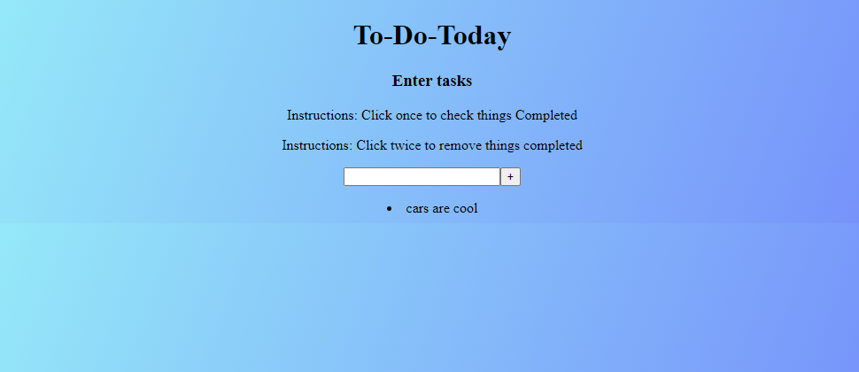

# Project: Todo List

### Goal: Build a To-do-list

This project was a Todo list where you can write tasks that need to be completed, create, cross & remove any that are either done or need to be changed.

### How it's Made:
Tech used:  HTML, CSS, Javascript

I took inspiration from a simple grocery list or daily task's
this was a great project to make considering its utility & simplicity.

### Lessons learned
I learned alot about different methods & functions used such as removeChild & createElement & style.list to make the completed tasks underlined.
Also i learned that setting different functionaity with each list item is completely up to the user such as making it double click instead of a button or X to delete a completed list item.

## Example

