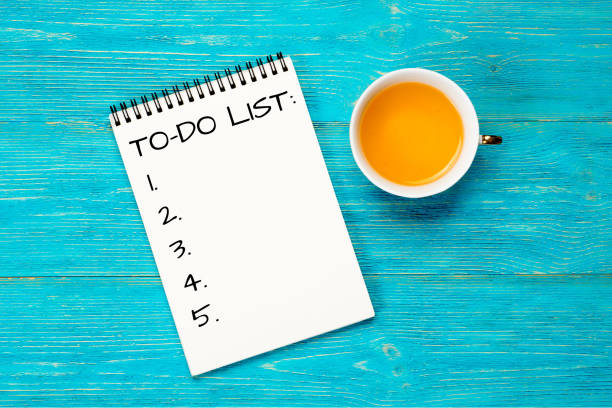

# ✅ Week05 Bootcamp2019 Project: Todo List

### Goal: Build a Simple Todo List
I made a Todo-list that adds things that need to be done to a list and clears them.

### tech i used:

- I used html to layout my page.
- I used CSS to style my page.
- I used JavaSCript to make my page reactive.
